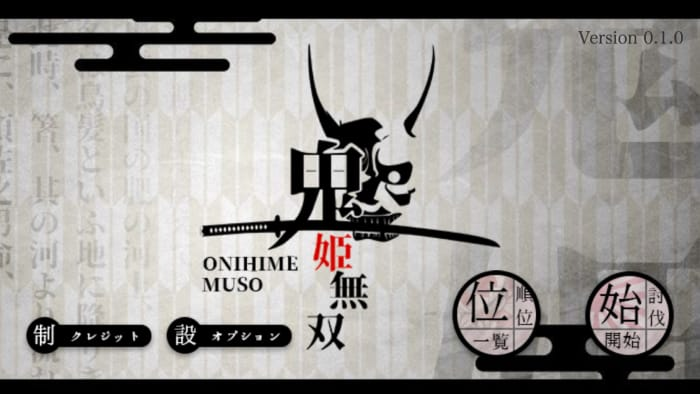
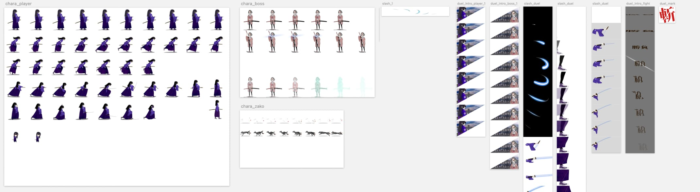
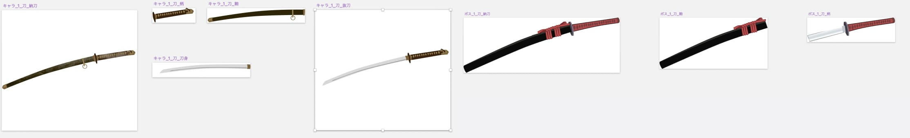
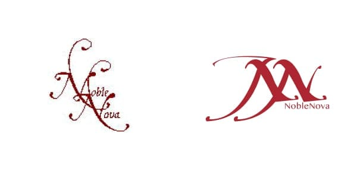
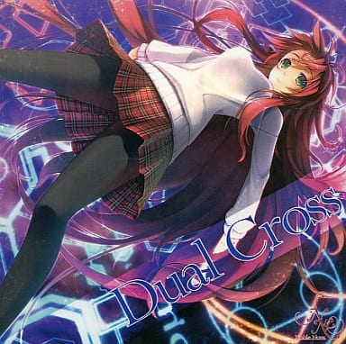

ゲームライブラリ [Phina.js](https://phinajs.com) に Nuxt.js を乗せた ブラウザクリッカーゲームです。

### 開発

ランキング機能は、Firebase を利用しました。 
開発の解説は、 Qiita の記事へ

- [Nuxt.js + phina.js でブラウザゲーを作るためにやったことまとめ](https://qiita.com/arinomurakumo/items/9c32111632fddae73169)

### 構成

<!-- このゲームのクリエイティブは、デザインというよりアートに近いです。  -->
 
ゲームデザインはマリオと同じです。 
全体のストーリーは壮大でしたが、ループ可能なプロットのみ抜粋して組み込んでいます。 
<!-- 肝心な音楽は、使いたい VST が高額で、クオリティに満足できずに無音としました。  -->
 
本来チュートリアルなしで理解できるデザインが一番素晴らしいですが、 
ブラウザで出来うる要素を試してみたく、設定や言語設定等の機能を盛り込みました。 

### 制作

イラストを描く技術はないので、手で下書きのみ書いて Illustrator / Sketch を利用しパスを引いていました。 
素材もスプライトを想定していたため、かなりのコマ数を書いて調整しながら制作しています。 

刀や靴等も小さくて見えないですが、モーション用にパーツが分かれています。 
異世界物ですが、軍刀に大太刀にとデフォルメされた小物も、世界観を表現する上でなくてはならない存在になりました。

## Noble Nova

2010 年にビジュアルノベルを制作するため、同人サークル NobleNova を立ち上げました。 
コミックマーケット78に参加した当時は音楽を担当し、作家 / 演出 / イラストとそれぞれ分業してチームを編成していましたが、 
今回は全て1人で完結。

ジャギー強めのブランドロゴもリプレイス

幻のビジュアルノベルのジャケット
