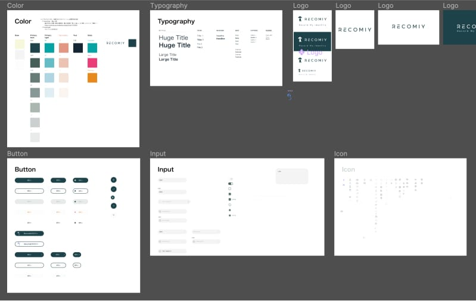
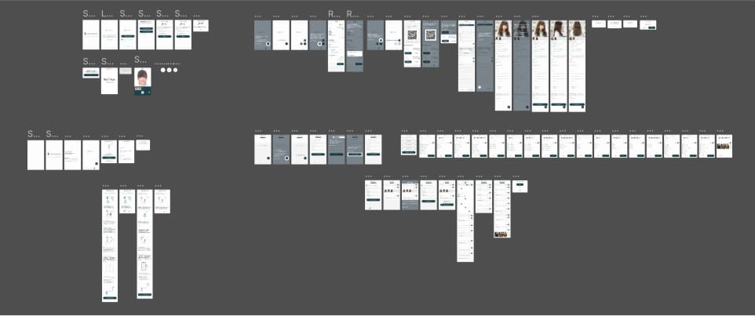

自分にあった美容師が見つかる美容カルテシェアサービス RECOMIY の 
ランディングページを制作しました。

## デザインシステム

制作中のアプリケーションのコンセプト、サービス設計にも携わっているため、 
ランディングページにもデザイントークンをそのまま利用しています。

## 動画広告

<iframe width="560" height="315" src="https://www.youtube.com/embed/AWrB8LR2QkY" title="YouTube video player" frameborder="0" allow="accelerometer; autoplay; clipboard-write; encrypted-media; gyroscope; picture-in-picture" allowfullscreen></iframe>

PSF 調査 のため、SNS での動画広告用のクリエイティブも作成しました。 
広告に合った時間やキャッチ、テストを実施し、複数バージョンを作成しています。

## ユーザーインタビュー

こちらも PSF 調査 のため、動画とプロトタイプを使った カスタマー調査を行いました。 
インタビューを通してプロトタイプを繰り返し作り直し、アプリケーションのブラッシュアップに繋げます。
