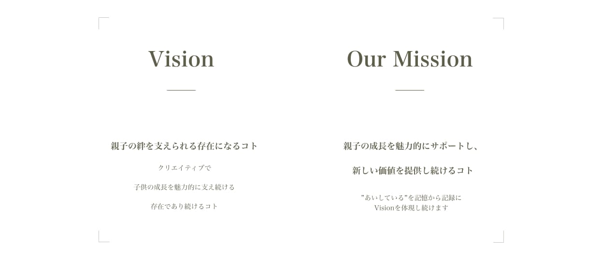
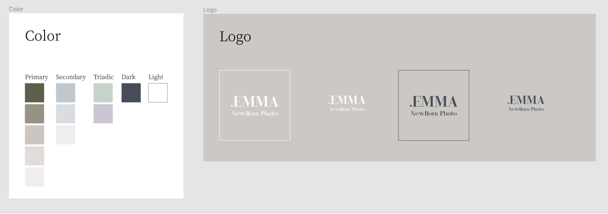
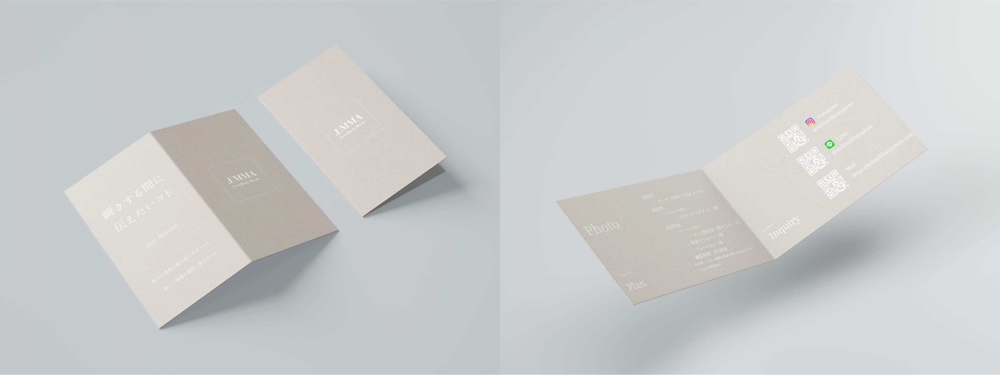

ニューボーンフォトを中心に活動しているフリーランスのフォトブランド ”EMMA” のサービスサイト。 
全般制作しました。

## 開発

立ち上げ当初は静的のペライチページでしたが、活動に合わせて情報が増えたため CSR で問題ないこともあり React で組み直しました。 
ES6 バニラで書かれた Javascript を React 化しましたが、いい教材になりそうです。デザインから規約ベースの Tailwind CSS を採用しています。

## インタビューからの深掘り

クリエイターとしての成り立ちやサービスへの想いなど、表層に至るまでの所謂UXの5段階モデルを元に 
サービスコンセプトや理念を言語化し、ビジュアライズしました。

## 骨子の重要性

基幹となる骨子の認識をしっかり揃えることができていたため、ブランド名変更にもロゴとカラーの変更のみで、 
柔軟に対応することができました。

## Web ⇄リアル

限られた期間の大切な時間を扱うクリエイターの信頼感、サービスの一貫性のため、 
Web ⇄ リアル での流入の際も違和感がない様、サービスカードも同時に制作しました。
